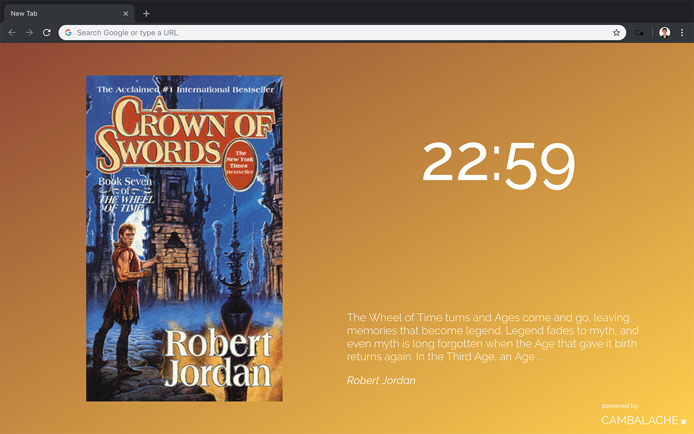

# Cambalache Chrome Extension

Chrome extension to display random books on a new tab. It replaces the default Google Chrome new tab page, showing a random book each time the user opens a new tab.

This project is directly related to the [Cambalache](http://cambalache.herokuapp.com) project.

## How to

To run this extension locally, visit `chrome://extensions` in your browser and ensure that the **Developer mode** checkbox in the top right-hand corner is checked. Click **Load unpacked extension** and select the directory in which your extension files live. If the extension is valid, it will be active straight away so you can open a new tab to see it alive.

## Team

| Name               | Github                                           | Email             |
|--------------------|--------------------------------------------------|-------------------|
| José Manuel Comber | [@jmcomber](https://github.com/jmcomber)         | jmcomber@uc.cl    |
| Raimundo Herrera   | [@rjherrera](https://github.com/rjherrera)       | rjherrera@uc.cl   |
| Javier López       | [@javierlopeza](https://github.com/javierlopeza) | javierlopez@uc.cl |
